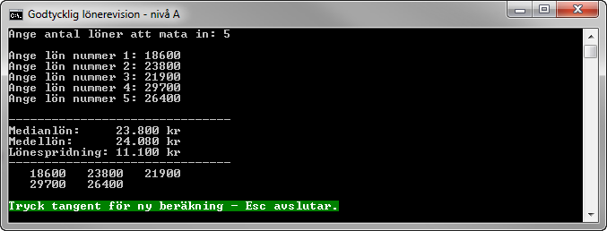

1.3 Godtycklig lönerevision (A-, B-, och C-nivå)
================================================
[1-3-godtycklig-lonerevision.pdf](https://github.com/1dv402/kursmaterial/raw/master/Laborationsuppgifter/1-3-godtycklig-lonerevision.pdf)

"Då en del fackförbund informerar om utfallet av löneförhandlingar redovisar de medianlönen (den mittersta lönen), genomsnittslönen och lönespridningen (skillnaden mellan den högsta och lägsta lönen). Skriv ett program som kan läsa in ett godtyckligt antal löner och sedan beräkna medianlön, medellön och lönespridning.

Programmet ska presentera, efter de beräknade värdena, lönerna i den ordning de matats in i med tre löner per rad."

